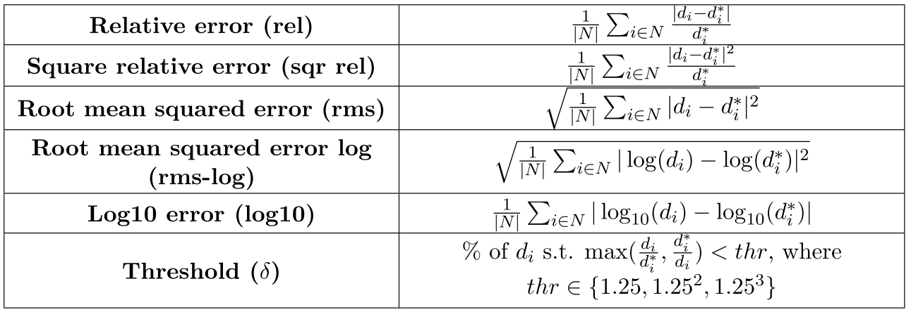

## Depth-prediction-completion

### Depth prediction & Depth completion
* depth prediction:   
-- input: RGB image, ground truth  
-- output: dense depth map  
-- dataset  
-- metrics:   

* depth completion:  
-- input: sparse raw depth data, RGB image(optional), ground truth (still sparse but denser than the raw data)  
-- output: dense depth map  
-- dataset  

